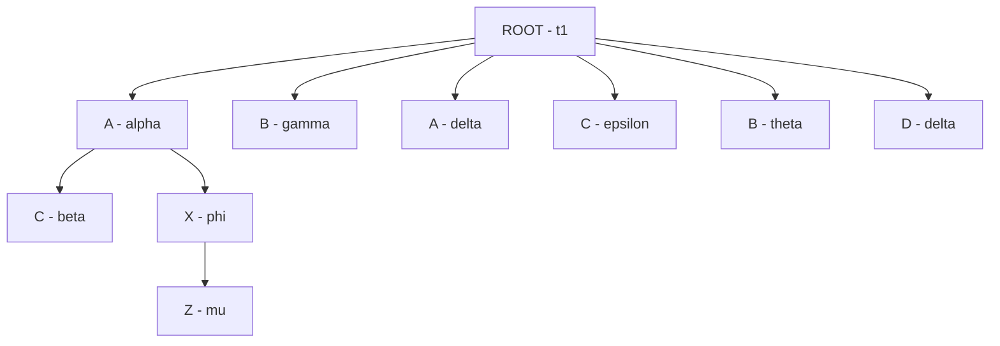
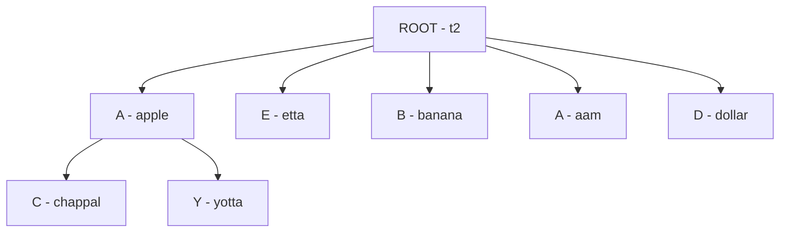

# Binary Tree

- At max 2 children
- Top-most node is called 'root'.
- If node has no children, it's called 'leaf' node.
- Each node has:
  - data
  - left child pointer (pointing to left subtree)
  - right child pointer (pointing to right subtree)

## Types of Binary Tree
1. Full Binary Tree:
   - Each node has "Either 0 or 2" children

2. Complete Binary Tree:
   - All levels should be completely filled, except last level.
   - Meaning, leaf node levels could be empty but should be "left-filled"
   - No restriction such as "2 children are must"

3. Perfect Binary Tree:
    - All leaf nodes should be on the same level.

4. Balanced Binary Tree:
    - Height of tree should be at max log(N).
    - Eg. if 8 nodes, then log2(8) = 3, hence 3 levels/height.
    - Used for efficient access.

5. Degenerate Tree:
    - Skewed Tree, every node has only one children.

## C++ Representation
```cpp
class Node {
    public:
        int data;
        Node* left;
        Node* right;
    
        // constructor
        Node(int val) {
            data = val;
            left = right = nullptr;
        }
};

int main() {
    Node* root = new Node(1);
    root.left = new Node(2);
    root.right = new Node(3);
    return 0;
}
```

## Merge Two Configs
#### Tree 1



#### Tree 2

