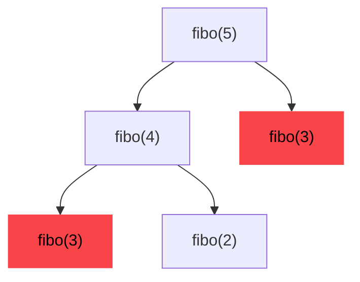

Striver's DP Series - [YouTube](https://www.youtube.com/watch?v=FfXoiwwnxFw&list=PLgUwDviBIf0qUlt5H_kiKYaNSqJ81PMMY&index=1)

### Techniques
1. Tabulation: i.e. Bottom-up
2. Memoization: i.e. Top-down

> _Along with **Time Complexity** (TC) and **Space Complexity** (SC), we should focus on Space Optimization._

### Overlapping Sub-problems
In the fibonacci problem, eg. fibo(5), the tree looks like this,



Here, the `fibo(3)` is already **pre-computed** hence this is a case of overlapping sub-problem.

Also, the data structure used to store the pre-computed result in the case of fibonacci series can be a 1-D array (as it has only 1 parameter in function)


## Memoization
Whenever we store the value of subproblems in a data structure (usually map or table), and use it in future to avoid pre-computing the same operation, we call this as Memoization.

### Fibonacci with DP Memoization
Steps involved,
1. Declare an array of DP solutions. Eg. dp[n+1] for fibonacci problem.
2. Storing answer for every sub-problem after computing in code.
3. Checking if sub-problem is solved previously, then return result from "DP array", before calling further recursion.

Fibonacci using Memoization,
```cpp
// using 'Memoization'
int fibo(int n, int dp[]) {
    if(n <= 1)
        return n;
    
    if(dp[n] != -1)
        return dp[n];
    int result = fibo(n-1, dp) + fibo(n-2, dp);
    dp[n] = result;
    return result;
}
```

## Tabulation
In case of Memoization, we start from Top to Bottom, but in Tabulation we start from the Bottom (i.e. recursion Base Case) and go upwards till the limit of 'n'.

Fibonacci using Tabulation,
```cpp
int fibo(int n, int dp[]) {
    dp[0] = 0;
    dp[1] = 1;
    
    for(int i = 2; i <= n, i++) {
        dp[i] = dp[i-1] + dp[i-2];
    }

    return dp[n-1];
}
```

## Identify DP Problem
Whenever there's a multiple possibilities to solve a problem, like,
- Count distinct number of ways to achieve the result
- Mimimum or Maximum value (Best way to achieve something)
- It's a recursive problem

It's probably a DP problem.

### Steps To Solve The Problem After Identification

Once the problem has been identified, the following three steps comes handy in solving the problem:

1. Try to represent the problem in terms of indexes.
2. Try all possible choices/ways at every index according to the problem statement.
3. If the question states
    - Count all the ways - return sum of all choices/ways.
    - Find maximum/minimum- return the choice/way with maximum/minimum output.
